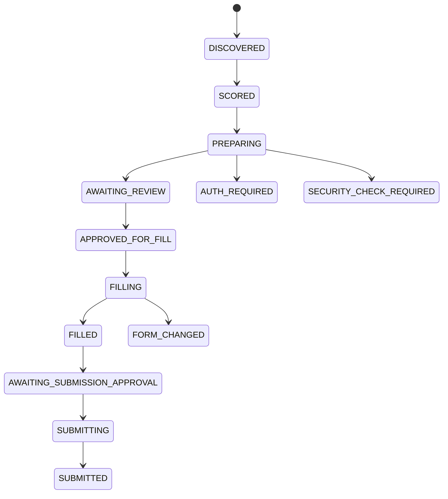

# Application lifecycle

Invalid commands return `WORKFLOW_STATE_CONFLICT`. Every successful canonical transition records its previous/next state, actor, timestamp, correlation ID, sanitized detail, and optional error. Legacy state names remain readable during migration. Submission approval binds the application, job fingerprint, profile snapshot, resume, answers, and form version. Submission reserves an idempotency key before the single browser click and is never automatically retried.
