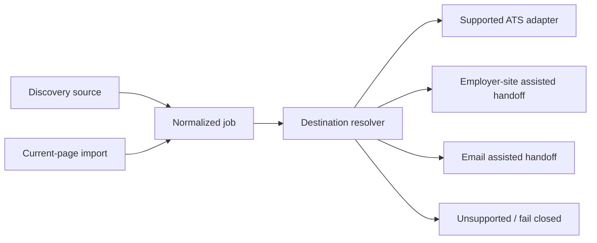

# Application router

`packages/destination-resolver` determines the application destination independently from the discovery source. It follows only validated URLs, checks exact/suffix host policy, recognizes supported ATS hosts, and otherwise returns an assisted employer/email handoff or unsupported result.

Current-page import prefers schema.org `JobPosting` JSON-LD. Fallback metadata is allowlisted, text-only, length-bounded, and tagged with provenance. Scripts, arbitrary DOM, credentials, cookies, and extension tokens are never imported.

