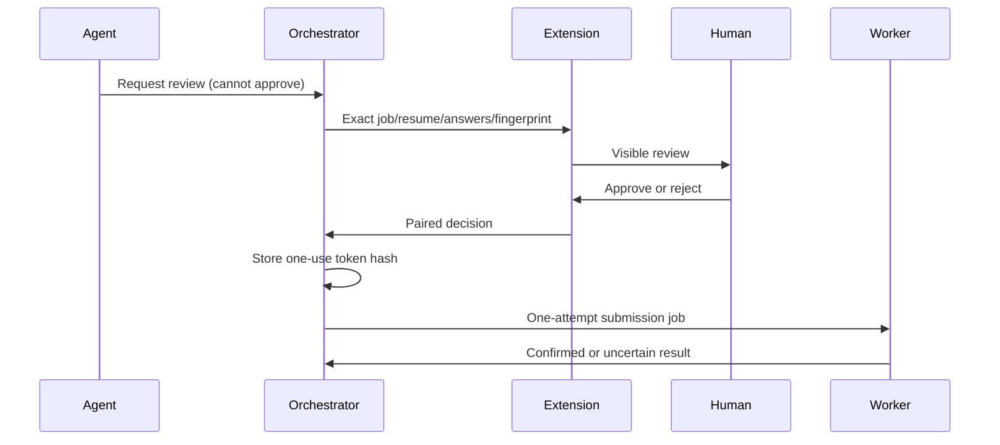

# Approval flow

The extension shows the job, employer, URL, selected resume, final answers, sensitive/skipped fields, warnings, and submission policy. A human decision approves that exact revision for a short period. Only a token hash is stored; approvals are one-use and invalidated by answer, profile, resume, form, cancellation, expiry, or emergency-stop changes. A repeated submit returns the persisted result or `DUPLICATE_SUBMISSION_PREVENTED` without another click.

