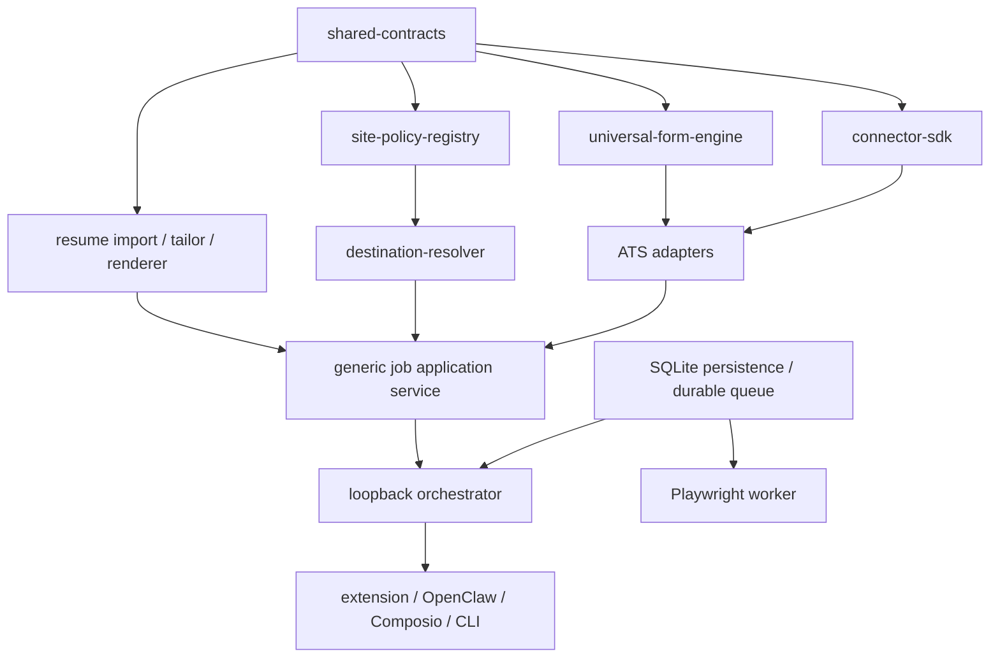
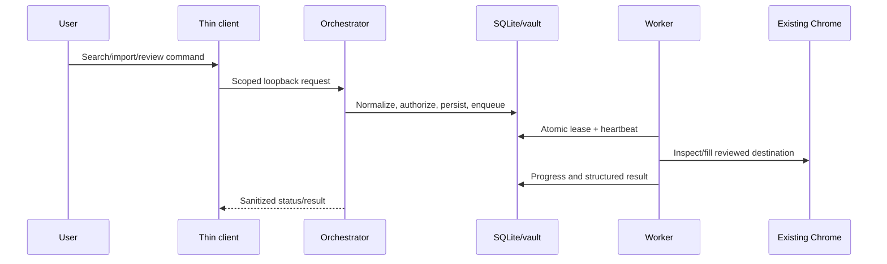

# Architecture

The loopback orchestrator is the policy boundary and intended system of record. Public clients are thin; domain packages hold reusable policy and deterministic logic; SQLite and the private artifact vault hold durable local state.

## Package dependencies

## Runtime flow

The generic service normalizes jobs, resolves discovery and destination independently, consults versioned capability policy, selects only verified profile facts, and owns the application lifecycle. Wuzzuf connector execution sits behind this service; deprecated Wuzzuf routes and tools are thin aliases back into it. Unknown connectors, states, capabilities, hosts, layouts, redirects, and form fingerprints fail closed.

The extension service worker owns its bearer session; content scripts receive only operation-specific messages. OpenClaw and Composio use distinct configured credentials and cannot approve submissions. Browser cookies remain inside the user's existing Chrome profile. Resume sources and generated files live in a private vault with opaque IDs and hashes.

The standalone worker runtime implements authenticated encrypted payloads, leases, heartbeat, cancellation, progress, results, recovery, and one-attempt final submission. Production Wuzzuf operations, browser-backed generic discovery used by search/campaigns, and Chromium resume rendering execute there. Development fixtures may run locally because they contain no production browser access. Unsupported ATS operations fail closed rather than falling back to daemon Playwright.
