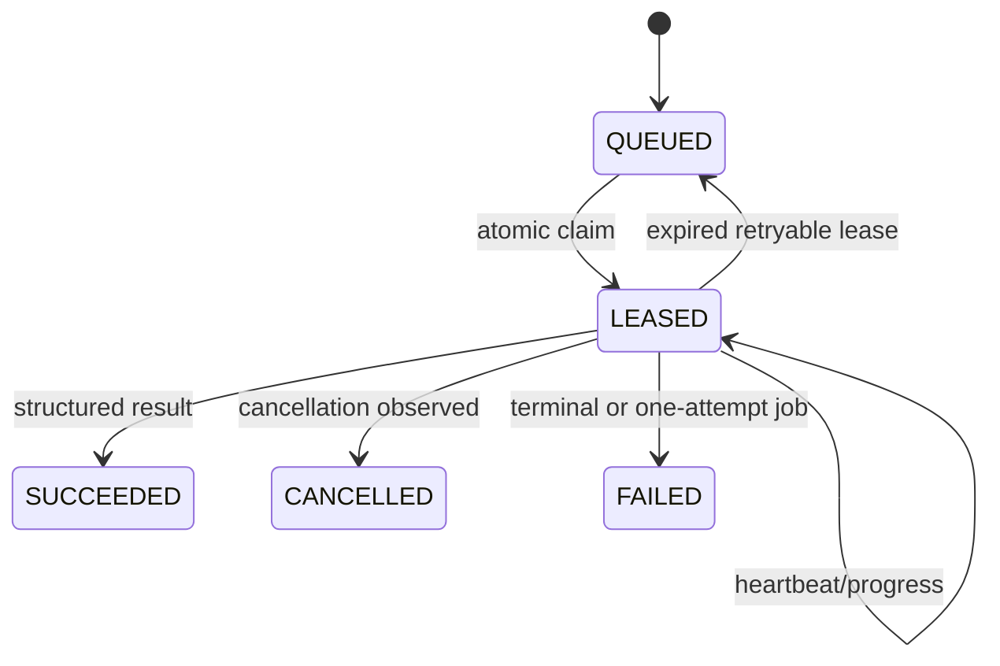

# Browser worker

`apps/playwright-worker` contains the standalone queue runtime. It claims jobs atomically, heartbeats leases, records bounded progress events, observes cancellation, stores structured results, and releases retryable work after a crash. Graceful shutdown stops new claims and finishes or releases the active lease.

Final submission jobs have a hard maximum of one attempt. A click with an uncertain outcome records a verification-required terminal result and requires manual review; the worker never retries it. Production Wuzzuf compatibility operations, browser-backed generic discovery, and resume rendering use authenticated encrypted jobs. Generic ATS application handlers remain fail-closed until a connector is explicitly enabled and maintained; they never fall back to inline daemon Playwright.

