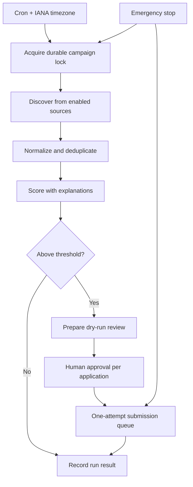

# Campaign workflow

Campaigns are persisted and scheduled by the local orchestrator. A run acquires a durable lock, gets one correlation ID, searches enabled sources, normalizes and deduplicates jobs, scores with factor explanations, and prepares review items above the configured threshold. `research_only` stops after scoring; `prepare_and_review` is the safe default. Campaigns never approve on behalf of a human.

Missed-run policy, quiet hours, maximum runtime, cancellation, and emergency stop are enforced locally. See [campaign scheduling](campaigns-and-scheduling.md).
