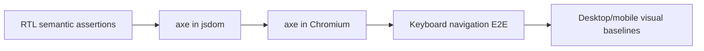

# Dashboard accessibility

Target: WCAG 2.2 AA for the primary dashboard workflows.

## Implemented practices

- A skip link and explicit main, navigation, banner, complementary, region, article, table, and dialog landmarks.
- One page-level `h1`; section headings progress semantically.
- Keyboard-operable navigation, filters, table actions, drawers, dialogs, campaign controls, and command palette.
- `Cmd/Ctrl+K` opens workspace navigation; Escape closes transient surfaces.
- Visible focus rings with adequate offset.
- Form labels, fieldsets/legends, descriptions, errors with `role=alert`, and live assistant output.
- Textual state alongside color, accessible score labels, chart summaries, and labeled icon-only buttons.
- Scroll containers around wide tables rather than document-level horizontal overflow.
- Light and dark contrast verified by Chromium axe; serious and critical violations fail E2E.
- `prefers-reduced-motion` collapses transitions and animations.
- Forced-color boundaries remain visible.
- Controls use a minimum 40px target in the desktop shell and grow or stack on small screens.

## Test coverage

Chromium runs at 1440×1000 and 390×844. The suite checks authenticated navigation, the command palette, Jobs Explorer, zero serious/critical axe findings, and light/dark screenshots. Manual visual review verifies legibility, wrapping, card stacking, and no horizontal overflow.

## Known accessibility boundaries

Native PDF viewer accessibility depends on the installed browser. The dashboard provides metadata and a separate tailoring diff before the PDF link. Extremely large job tables use an explicit scroll region; row virtualization is intentionally not enabled until measurement shows it is necessary.
