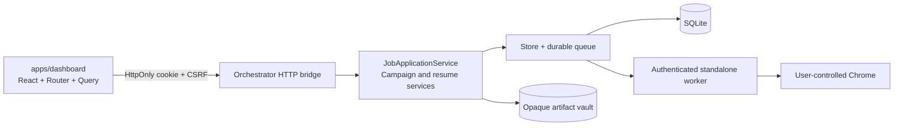
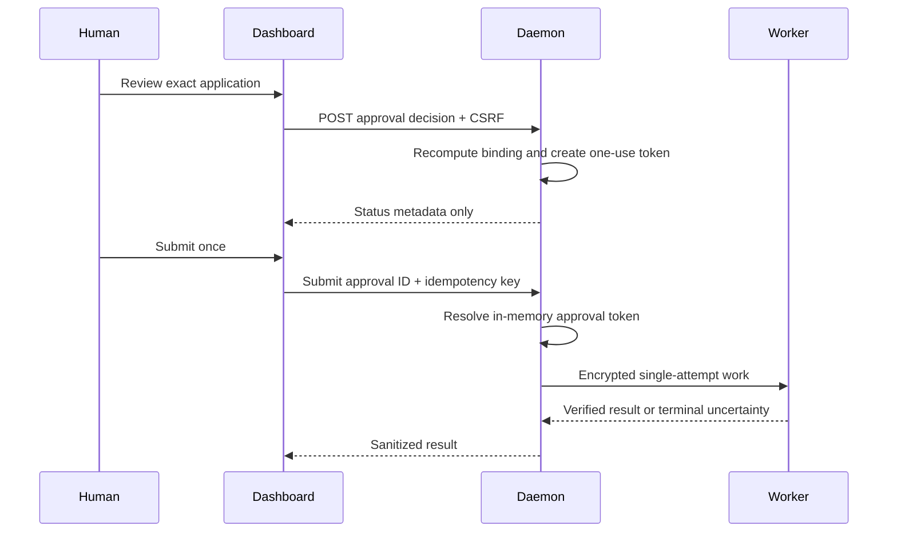

# Dashboard architecture

The dashboard is a workspace inside the existing monorepo. It is a client of the authenticated loopback daemon, not a backend and not a second source of business rules.

## Boundaries

- React owns presentation, client cache, URL-synchronized filters, and ephemeral interaction state.
- The bridge owns session authentication, CSRF, origin checks, validation, pagination, correlation IDs, rate limits, and safe serialization.
- Services own scoring, connector capabilities, campaigns, resume tailoring, approvals, idempotency, and emergency stop.
- `Store` owns all SQLite access. Dashboard code never imports a database driver.
- The worker owns Playwright and PDF rendering. Dashboard code never imports Playwright.
- Final submission is still a daemon workflow. The approval token is retained in daemon memory and never serialized to the dashboard.

## Data flow

## Frontend structure

- `app/`: authentication boundary, shell, routing, command palette, assistant, live event subscription.
- `components/`: reusable accessible presentation primitives.
- `lib/`: typed API client and dashboard view models.
- `pages/`: lazy-loaded product workspaces.
- `e2e/`: deterministic daemon fixture, functional Chromium tests, axe checks, and visual baselines.

The daemon serves `apps/dashboard/dist` under `/dashboard/`. Vite development uses the same paths and proxies `/v1` and `/health` to the local daemon.
