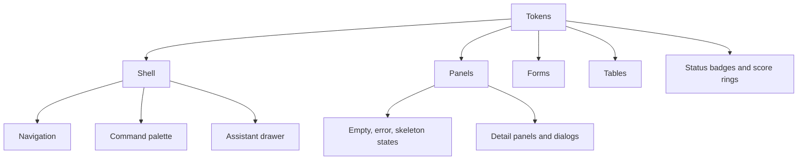

# Dashboard design system

The dashboard uses a restrained editorial operations aesthetic: warm neutral canvas, paper-like surfaces, deep ink, mineral green for trusted actions, amber for review, and red reserved for stops or failures. It avoids default template gradients and decorative effects that compete with operational data.

## Tokens

All tokens live in `apps/dashboard/src/styles.css` as CSS custom properties:

- canvas, surface, raised surface, and soft surface;
- primary, secondary, and faint text;
- normal and strong borders;
- accent, warning, danger, and informational colors plus tonal surfaces;
- small, medium, and large radii;
- small and large shadows;
- sidebar and top-bar dimensions;
- shared easing and motion durations.

Light, dark, and system themes are supported. System theme follows `prefers-color-scheme`. Forced colors retain visible boundaries; reduced motion collapses animation and transition duration.

## Typography and density

The stack uses locally available `Inter`, `Avenir Next`, `Segoe UI`, then the system sans serif. No font or tracking request leaves the machine. Display headings are tightly tracked; body and operational labels remain compact but meet contrast requirements.

## Components

Status is never communicated by color alone. Each badge has text, charts have an accessible label, score rings expose a numeric accessible name, and icon-only controls have labels. Lucide provides one consistent stroke-icon system.

## Responsive behavior

- 1440/1280: full navigation, two-column overview, three-column card grids.
- 1024: reduced header chrome and two-column grids.
- 768: off-canvas navigation, single-column content, horizontally scrollable data tables.
- 390: touch-sized controls, stacked metrics/forms, hidden nonessential header text, no document overflow.

Motion is limited to drawers, dialogs, subtle hover translation, loading indicators, and skeleton shimmer.
