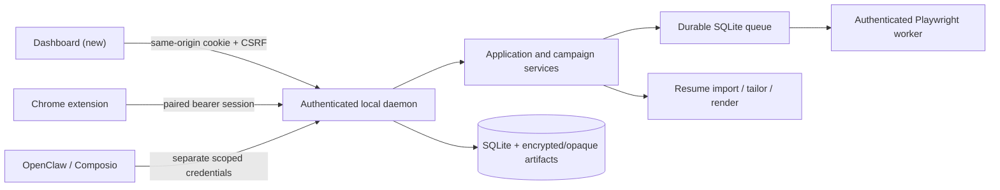

# Dashboard implementation audit

Date: 2026-07-23  
Baseline commit: `312f2c5765cbd46f2d02bd9649a6c0fdf8540029`

## Scope reviewed

The implementation review covered the root workspace configuration, the orchestrator HTTP bridge and service layer, SQLite migrations and `Store`, shared domain and Zod contracts, workflow transitions, resume import/tailoring/rendering, the durable worker boundary, the OpenClaw plugin and bundled skill, the Chrome extension, and the unit/contract/integration/E2E suites.

## Existing architecture to preserve

- The daemon is the only supported access point for persisted state.
- `JobApplicationService` owns the generic application lifecycle; the Wuzzuf facade is a compatibility alias.
- Site policies and connector capabilities fail closed.
- Final submission is bound to a short-lived, one-use approval and idempotent submission reservation.
- OpenClaw and Composio cannot grant human submission approval with their default scopes.
- Browser cookies, selectors, and Playwright remain inside the worker/adapter boundary.
- Resume source bytes and rendered artifacts are stored through the artifact vault and are not returned by list APIs.

## Baseline verification

| Check | Result |
|---|---|
| `npm ci` | PASS |
| `npm run doctor` | PASS; optional local services were not running |
| `npm run lint` | PASS |
| `npm run typecheck` | PASS |
| `npm run test:unit` | PASS — 31 |
| `npm run test:contract` | PASS — 10 |
| `npm run test:integration` | PASS — 18 |
| `npm run test:e2e` | PASS — 11 |
| `npm run build` | PASS |

The first sandboxed integration/E2E attempt could not bind loopback ports (`EPERM`). Both suites passed unchanged when run with permission to launch their local fixture servers.

## Gap analysis

| Requirement | Existing support | Implementation gap |
|---|---|---|
| Dashboard workspace | None | Add `apps/dashboard` and root lifecycle scripts |
| Browser authentication | Extension bearer sessions | Add short-lived HttpOnly same-origin dashboard sessions, CSRF, exact origin validation, and logout |
| Focused dashboard queries | One legacy aggregate endpoint | Add bounded, cursor-based job/application/activity APIs and summaries |
| Human approval center | Extension approval endpoint | Add a dashboard-only decision route that never exposes approval tokens |
| Live status | Health endpoints | Add bounded SSE notifications with reconnect support |
| Saved views and preferences | None | Add minimal migration and daemon-owned CRUD |
| Manual-action inbox | Workflow states only | Add derived and persisted manual-action items |
| Jobs/application UX | Extension side panel | Build accessible explorer, detail, table, Kanban, and timelines |
| Resume Studio | Daemon import/tailor/render APIs | Expose focused review metadata and build upload/fact/diff/PDF UI |
| Campaign workspace | Create/run/pause/resume APIs | Add list/detail/update/preview endpoints and a safe builder |
| Connector administration | Capability endpoints | Add explicit enable/disable aliases and truthful UI |
| Assistant | Authenticated NDJSON chat | Add dashboard-scoped chat proxy behavior without approval authority |
| Accessibility/visual regression | No dashboard | Add component, axe, E2E, responsive, and screenshot coverage |

## Security decisions

1. The dashboard does not receive or persist daemon bearer tokens.
2. Dashboard sessions are opaque, short-lived, HttpOnly, `SameSite=Strict` cookies.
3. Mutations require a session-bound CSRF value in addition to exact loopback-origin checks.
4. The dashboard approval response contains status metadata only; the one-use submission token stays daemon-owned.
5. Dashboard list/detail contracts return sanitized facts and audit detail, never raw resume bytes, filesystem paths, browser cookies, selectors, or tool credentials.
6. Existing extension, OpenClaw, Composio, CLI, worker, and compatibility endpoints remain intact.

## Planned phases

1. Add shared dashboard contracts, migration, store query methods, session security, focused APIs, static serving, and backend tests.
2. Add the React/Vite foundation, design tokens, routing, query client, authenticated shell, command palette, theme, and responsive navigation.
3. Implement all real data workflows: overview, jobs, applications, resumes, approvals, campaigns, connectors, manual actions, activity, settings, and assistant.
4. Add accessibility, live updates, motion restraint, performance/code splitting, component tests, E2E, and visual snapshots.
5. Run the complete regression, packaging, security, accessibility, visual, and production-build matrix and document acceptance evidence.
