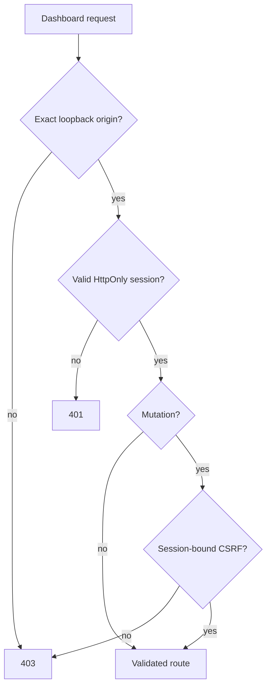

# Dashboard security

## Authentication

The pairing code is exchanged only with the loopback daemon. A successful exchange creates:

- a 256-bit opaque session value stored in an HttpOnly cookie;
- `SameSite=Strict`, path `/`, and a bounded maximum age;
- a separate 256-bit CSRF value retained only in frontend memory;
- a server-side session record keyed by a SHA-256 hash.

Refreshing the session rotates its CSRF value. Logout invalidates the server record and expires the cookie.

## Request controls

- The server is bound to loopback and only accepts a same-host `127.0.0.1` or `localhost` dashboard origin.
- Body size, rate, filter length, list length, pagination, text, numeric range, and cursor values are bounded.
- CSP is `default-src 'self'` with no inline script, object, external connection, framing, or alternate form destination.
- Referrer, MIME sniffing, browser capability, and cache headers are restrictive.
- Mutations use correlation and idempotency keys. Versioned notes/views/preferences return a precondition failure on stale writes.

## Approval authority

OpenClaw and Composio credentials do not authenticate dashboard routes. Approval decision endpoints require the dashboard cookie and CSRF. When approved, the application service returns a one-use token internally; `DashboardSessions` retains it in memory and sends only redacted status metadata to the browser. A later explicit submit request references the approval ID, and the daemon supplies the retained token.

No approve-all, permanent approval, silent approval, or bulk submission endpoint exists.

## Data minimization

Dashboard APIs never expose raw resume bytes in list/detail JSON, filesystem paths, browser cookies, selectors, token hashes, worker secrets, or approval tokens. PDF content is restricted to authenticated local inline viewing of a `resume-pdf` artifact. Audit and list responses use central sanitizers. An authenticated single-application detail response intentionally includes the exact prepared values so the human approval screen can review the state it is binding; those values are never copied into audit events or approval-list responses.

## Threat model notes

Job descriptions are untrusted data. They are rendered as text, not HTML. React escaping, CSP, exact origin checks, connector URL policies, and worker isolation prevent job content from becoming executable instructions. SQLite and artifacts retain the existing private file permissions.
