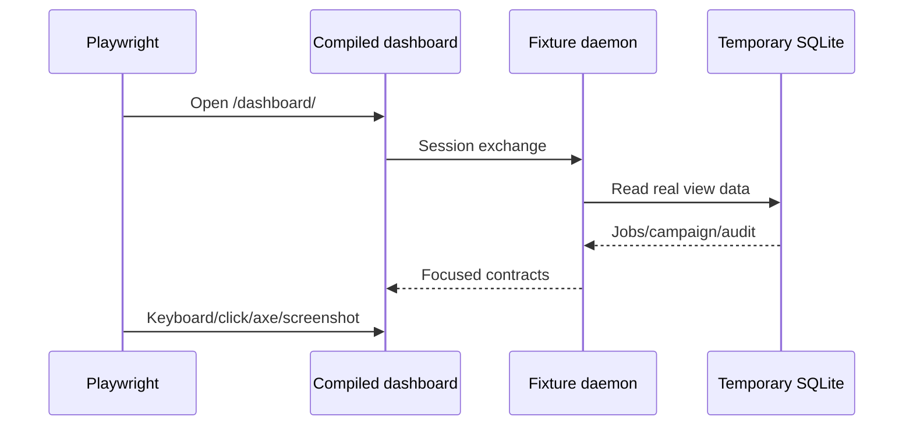

# Dashboard testing

## Commands

```sh
npm run --workspace @extension-jobs/dashboard typecheck
npm run test:dashboard
npm run --workspace @extension-jobs/dashboard build
npm run test:dashboard:e2e
npm run test:integration
npm run test:e2e
npm test
```

The dashboard E2E command builds the production assets, starts a deterministic loopback daemon, and runs desktop/mobile Chromium projects.

## Coverage

| Layer | Coverage |
|---|---|
| Shared/store | migration 004, saved state primitives, safe serialization |
| API integration | cookie session, exact origin, CSRF, pagination, safe bulk actions, OpenClaw exclusion, secret redaction |
| Components | accessible scores/status, common page primitives, pairing boundary |
| Functional browser | login, real summary data, command palette, Jobs navigation/detail |
| Accessibility | jsdom axe plus Chromium axe serious/critical gate |
| Visual | 11 reviewed baselines: Overview light/dark desktop/mobile plus Jobs, job detail, Resume Studio, Applications, Approvals, Campaigns, and Connectors in dark desktop |
| Regression | existing unit, contract, integration, worker/Playwright/PDF, extension, plugin and package suites |

## Deterministic fixture

`apps/dashboard/e2e/fixture-server.ts` creates a temporary private SQLite database, verified profile, four scored jobs, one bounded research campaign, and a sanitized audit event. It uses the production bridge and compiled dashboard. It does not mock frontend requests.



## Visual baselines

Baselines are in `apps/dashboard/e2e/dashboard.spec.ts-snapshots`. Update them only after intentional design review:

```sh
npx playwright test --config apps/dashboard/playwright.config.ts --update-snapshots=all
```

The snapshot tolerance is 1.2% pixel ratio to accommodate platform text rendering while still detecting layout regressions.

## Sandbox note

Integration and E2E tests bind loopback ports and launch Chromium. Restricted execution environments must explicitly allow those local operations; an `EPERM` bind failure is environmental rather than an application failure.
