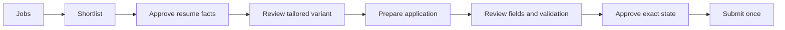

# Dashboard user guide

## Start and sign in

1. Run `npm ci`, `npm run build`, then start Extension Jobs.
2. Open `http://127.0.0.1:18790/dashboard/`.
3. Enter the one-time pairing code printed by the daemon or stored in your private local configuration.
4. Keep the daemon running. The dashboard intentionally has no hosted fallback.

The browser session is short-lived. Reloading after expiry returns to the pairing screen.

## Daily workflow

### Overview

Use the attention queue first. It consolidates approval requests, manual actions, resume review, and emergency-stop state. Metrics and charts are derived from local data.

### Jobs Explorer

Search and filter on the server. Select a role to inspect its match explanation, description, and connector capability. Safe bulk actions are shortlist, reject, and tag; bulk submission does not exist.

### Resume Studio

Import PDF, DOCX, Markdown, text, JSON, or YAML. Inspect extracted facts and provenance before approval. Approval creates an immutable profile snapshot. Tailored variants show changes, missing requirements, validation, and a PDF link when the render worker is available.

### Applications

Switch between table and board views. Open an application for fill counts, validation, sensitive fields, errors, and its append-only state timeline.

### Approval Center

Read the exact review record and expiry. Approve or reject one request. Approval remains bound to the reviewed answers and form fingerprint. When approved, a separate “Submit once” action uses the daemon-held one-use token.

### Campaigns

Choose queries, locations, an approved profile, score threshold, per-run/day caps, mode, and dry-run state. Preview effective safeguards before creating. Pause or resume at any time. “Auto submit” is normalized to prepare-and-review.

### Connectors

Capability cards distinguish discovery, details, fill, submit, user-presence, and approval requirements. Disabled or unsupported actions are shown honestly.

### Activity and assistant

Activity contains sanitized events and correlation IDs. The assistant can explain local state and draft grounded text; it has no approval or submission controls.

## Keyboard and display

- `Cmd+K` on macOS or `Ctrl+K` elsewhere opens the command palette.
- Escape closes palettes and drawers.
- Use the theme control for light/dark; Settings also supports system theme.
- The sidebar becomes an off-canvas menu on tablets and phones.

## Emergency stop

Use the persistent top-bar control or Settings. It requests cancellation of queue work and blocks new automation. It does not delete jobs, resumes, or history. Clear it only after reviewing the cause.

## Troubleshooting

- “Dashboard authentication required”: pair again.
- CSRF failure: reload, which rotates a fresh session-bound CSRF value.
- Daemon offline: run `npm run doctor`, then start Extension Jobs.
- Browser not connected: use the connector’s manual login flow in user-controlled Chrome.
- Tailoring has no PDF: run the standalone worker and retry the idempotent tailoring operation.
- Security challenge: complete it manually; automation deliberately stops.
