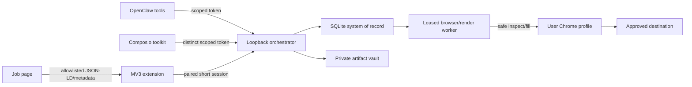

# Data flow

Approval is created from the extension decision surface and is bound to the reviewed job, resume, answers, profile snapshot, and form fingerprint. The daemon stores only its hash; the one-use value remains in extension memory. Worker results flow back to SQLite and safe status APIs.
