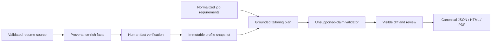

# Resume tailoring

`packages/resume-tailor` produces a deterministic plan from a normalized job and verified profile facts. It may select, order, and rephrase supported facts, but it cannot invent employers, dates, skills, metrics, education, titles, or credentials.

The output includes matched and missing requirements, every supporting fact ID, validation findings, and a visible structured diff. Validation fails if output contains an unsupported claim or an unverified/rejected fact.

