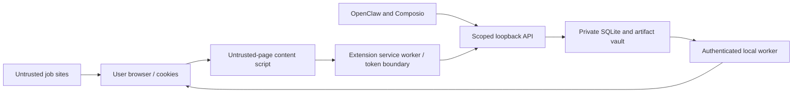

# Security model

The orchestrator binds to loopback and is the authorization and policy boundary. The extension uses a short-lived paired session; OpenClaw and the Composio host use separate secrets. Client enrollments persist only token hashes, scopes, expiry, and revocation state. Route-level scope checks are enforced for each credential. Default agent credentials omit `applications:submit` and `applications:approve`; the paired extension owns approval/submit. Even an explicitly submit-scoped client still needs the exact, short-lived, one-use human approval token.

Wuzzuf credentials, passwords, cookies, and security-challenge tokens are never stored or returned. Browser login remains under user control. Cloudflare, CAPTCHA, and other access checks cause `SECURITY_CHECK_REQUIRED`; automation stops and never attempts bypass. Central sanitizers redact secrets, local paths, browser internals, resume text, and private diagnostics before audit or tool output.
